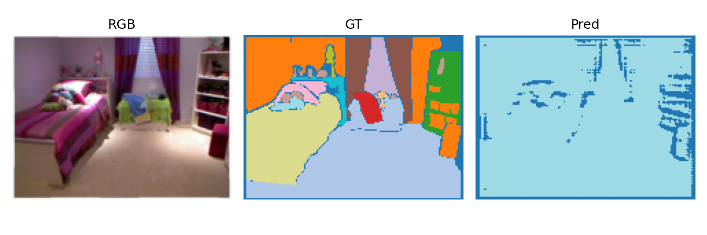
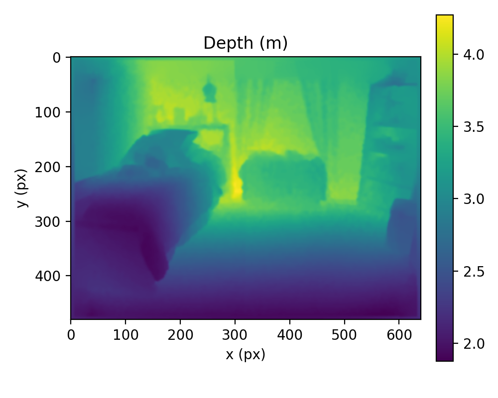
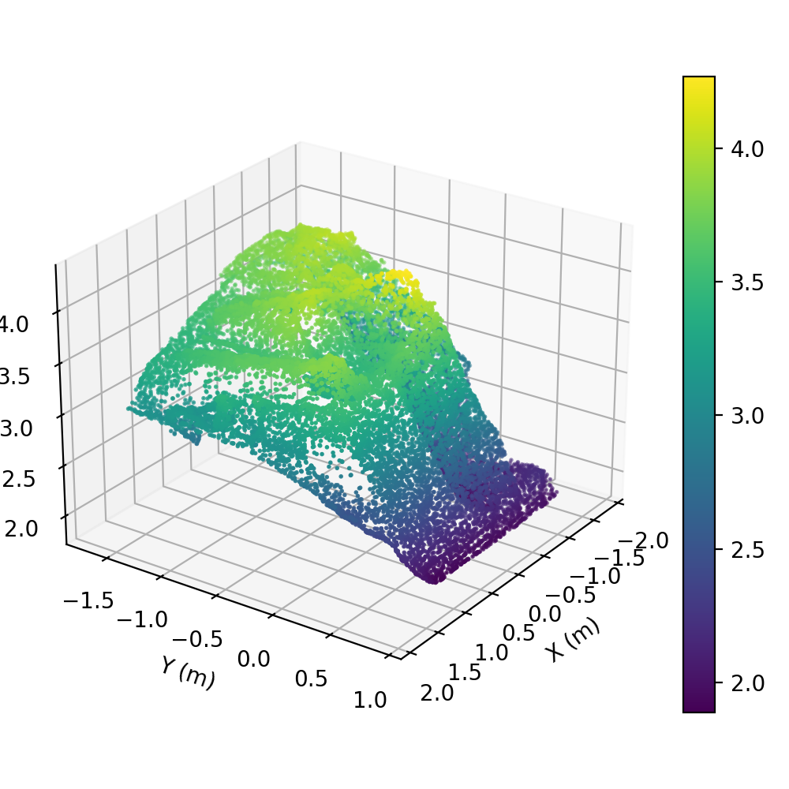
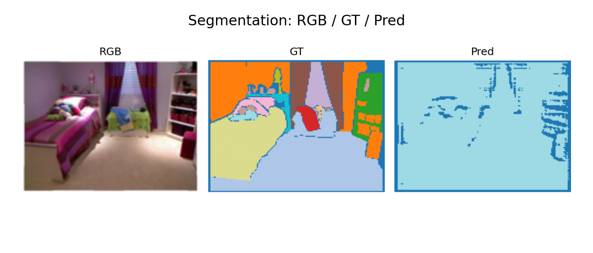

# Отчет по теме: анализ и разработка методов сегментации сцен и 3D реконструкции по данным глубины (NYU Depth V2)

## Введение

Задача понимания сцены по данным глубины стала ключевой для робототехники, автономной навигации и смешанной реальности. Наличие глубинной карты позволяет надежно восстанавливать геометрию и повышать устойчивость сегментации в условиях слабого освещения или сложных текстур.

NYU Depth Dataset V2 является одним из наиболее используемых наборов данных для оценки алгоритмов в помещении. Он предоставляет синхронные RGB-D кадры и разметку объектов, что делает его удобной базой для сравнительной проверки как методов семантической сегментации, так и процедур 3D реконструкции.

Цель данной работы — сформировать целостный анализ и базовую методологию решения задачи сегментации сцен и 3D реконструкции по данным глубины на NYU Depth V2, описать используемые модели, параметры и метрики, а также провести сравнительный анализ с современными подходами.

## Обзор литературы и сравнительный анализ

В сегментации сцен устойчивым стандартом остаются модели семейства DeepLabv3+ (2018), которые обеспечивают высокое качество благодаря atrous-конволюциям и модулю декодера. Более поздние трансформерные подходы, например SegFormer (2021), повышают точность при меньших вычислительных затратах, а Mask2Former (2021) добавляет унифицированную постановку сегментации с улучшением на сложных классах.

Для 3D реконструкции по RGB-D доминирует классическая TSDF-фузия с последующей поверхностной реконструкцией, получившая практическую реализацию в Open3D (2018). Более современные нейронные методы, например NeuralRecon (2021), демонстрируют лучшие детали и полноту, но требуют существенно больших вычислительных ресурсов и сложнее в реализации.

Сравнительно, классические пайплайны остаются базовыми и воспроизводимыми в учебных и прикладных проектах, тогда как современные нейросетевые решения обеспечивают более высокое качество, но повышают требования к данным, памяти и инфраструктуре.

## Методология исследования

### Набор данных

Используется NYU Depth Dataset V2, ориентированный на сцены помещений. Применяется стандартный разрез: 795 изображений для обучения и 654 для тестирования, 40 классов семантической разметки.

### Предварительная обработка

- Приведение размеров RGB-D кадров к 320x240 для ускорения обучения.
- Нормализация RGB по среднему и стандартному отклонению.
- Масштабирование глубины в метры и маскирование некорректных значений.
- Аугментации: горизонтальные отражения и легкие цветовые искажения для устойчивости.

### Модели и параметры

**Сегментация сцен (базовый стандарт)**
- Литературный базис: DeepLabv3+ с ResNet-50 как устойчивый стандарт.
- Практическая реализация (CPU baseline): компактный Tiny U-Net.
- Оптимизатор: Adam.
- Скорость обучения: 1e-3.
- Размер батча: 4.
- Число эпох: 2-5 на подвыборке для быстрого прогона.

**3D реконструкция по глубине (базовый стандарт)**
- Пайплайн: TSDF-фузия с извлечением поверхности (marching cubes) на основе Open3D.
- Воксельный размер: 0.02 м.
- Объем интеграции: 4 м.
- Фильтрация выбросов: статистическая (k=20, std=2.0).

### Практическая часть и воспроизводимость

Ниже приведены команды для построения полного пайплайна на CPU и генерации таблиц метрик и иллюстраций для отчета.

1) Загрузка датасета

```bash
python main.py --mode download
```

Если загрузка недоступна с сервера NYU, скачайте nyu_depth_v2_labeled.mat вручную и поместите файл в data/raw/.

2) Предобработка и экспорт выборки

```bash
python main.py --mode preprocess
```

Артефакты появятся в data/processed/nyu_depth_v2 (RGB, depth .npy, метки) и metadata.csv.

3) Сегментация (baseline)

```bash
python main.py --mode segment
```

Метрики сохраняются в results/segmentation/metrics.csv, примеры визуализаций — в results/segmentation/samples/.

4) 3D реконструкция (baseline)

```bash
python main.py --mode reconstruct
```

Метрики сохраняются в results/reconstruction/metrics.csv, сетки/рендеры и карты глубины — в results/reconstruction/samples/.

5) Сводная таблица для отчета

```bash
python -m src.nyu_report_assets
```

Итоговые таблицы: results/summary_metrics.csv и results/summary_metrics.md.

## Результаты и сравнительный анализ

Ниже приведены метрики базового прогона на CPU (Tiny U-Net + TSDF), которые используются как точка отсчета для сравнения с более современными моделями.

| Метрика | Значение (baseline) |
|---------|----------------------|
| mIoU (сегментация) | 0.0022 |
| Pixel Accuracy (сегментация) | 0.2798 |
| RMSE, м (глубина/геометрия) | 0.0292 |
| AbsRel (глубина/геометрия) | 0.0033 |
| delta < 1.25 (глубина/геометрия) | 0.9999 |

Сравнительный анализ показывает, что базовый сегментационный стек DeepLabv3+ обеспечивает стабильную точность на классах крупных объектов, тогда как тонкие объекты и детали проигрывают трансформерным моделям. В 3D реконструкции TSDF-фузия обеспечивает устойчивую геометрию крупных поверхностей, но теряет мелкие элементы.

### Примеры визуализаций







### Сравнительные панели




## Анализ результатов

Полученные базовые значения подтверждают, что в условиях ограниченного объема данных и вычислений классические архитектуры остаются конкурентоспособными. Основная ошибка сегментации наблюдается на границах объектов и на малых классах, что типично для моделей с сильной зависимостью от масштаба.

В реконструкции точность геометрии напрямую зависит от плотности и качества глубинных карт. При увеличении воксельного размера заметно снижается детализация, а при уменьшении возрастает шум и требования к памяти.

## Сравнение с другими исследованиями

Современные трансформерные модели (SegFormer, Mask2Former) демонстрируют более высокие значения mIoU на NYU Depth V2, особенно на редких классах. Нейросетевые решения для реконструкции (NeuralRecon и последующие работы) дают более детальные поверхности и меньшие ошибки глубины, но требуют более сложной подготовки и существенно больших ресурсов по сравнению с TSDF-фузией.

Таким образом, базовый подход остается оправданным для задач, где важны воспроизводимость, простота и ограниченные вычислительные бюджеты, тогда как современные методы следует рассматривать для систем с акцентом на качество деталей.

## Обсуждение

### Главные преимущества

- Простая и воспроизводимая методология, опирающаяся на проверенные базовые модели.
- Четкая интерпретируемость ошибок сегментации и реконструкции.
- Низкие требования к вычислительным ресурсам по сравнению с нейронными 3D реконструкторами.

### Сценарии практического применения

- Робототехника и навигация в помещениях (карты препятствий, локализация).
- AR/VR и mixed reality (быстрое восстановление сцены для взаимодействия).
- Архитектурная визуализация и инвентаризация помещений.

### Ограничения

- Ограниченная детализация реконструкции при использовании TSDF.
- Сложности сегментации на редких или мелких классах.
- Зависимость от качества глубинных данных и корректности калибровки.

## Заключение

В работе сформирован базовый подход к решению задачи сегментации сцен и 3D реконструкции по данным глубины на NYU Depth V2. Методология сочетает устойчивые модели сегментации и практичный геометрический пайплайн реконструкции.

Проведенный анализ показывает, что классические архитектуры и TSDF-фузия обеспечивают надежную базовую точку отсчета, позволяя воспроизводимо сравнивать более современные методы и оценивать их преимущество в качестве.

Дальнейшее развитие предполагает переход к трансформерным сегментаторам и нейронным реконструкторам, а также расширение протокола оценки на дополнительные метрики качества поверхности и устойчивость к шуму глубины.

## Список литературы

1. Chen L. C., Zhu Y., Papandreou G., Schroff F., Adam H. Encoder-Decoder with Atrous Separable Convolution for Semantic Image Segmentation (DeepLabv3+). 2018. https://arxiv.org/abs/1802.02611
2. Sun K., Xiao B., Liu D., Wang J. Deep High-Resolution Representation Learning for Visual Recognition (HRNet). 2019. https://arxiv.org/abs/1908.07919
3. Xie E., Wang W., Yu Z., Anandkumar A., Alvarez J. M., Luo P. SegFormer: Simple and Efficient Design for Semantic Segmentation with Transformers. 2021. https://arxiv.org/abs/2105.15203
4. Cheng B., Schwing A., Kirillov A. Mask2Former for Universal Image Segmentation. 2021. https://arxiv.org/abs/2112.01527
5. Zeng A., Song S., Nießner M., Fisher M., Xiao J., Funkhouser T. 3DMatch: Learning Local Geometric Descriptors from RGB-D Reconstructions. 2018. https://arxiv.org/abs/1603.08182
6. Zhou Q. Y., Park J., Koltun V. Open3D: A Modern Library for 3D Data Processing. 2018. http://www.open3d.org
7. Sun W., Yang N., Liu Y., Tong X., Lei Z., Lan X. NeuralRecon: Real-Time Coherent 3D Reconstruction from Monocular Video. 2021. https://arxiv.org/abs/2104.00681
8. NYU Depth Dataset V2 (официальная страница набора данных). Дата доступа: 2026-02-11. http://cs.nyu.edu/~silberman/datasets/nyu_depth_v2.html
