# Разведочный анализ данных (EDA) — Knee MRI Segmentation

Анализ набора данных МРТ коленного сустава из Osteoarthritis Initiative (OAI), содержащего срезы с разметкой анатомических структур для задачи автоматической сегментации.

**Датасет:** 3D Knee MRI Cartilage Segmentation (Kaggle: ujjwalsinha01/3d-knee-mri-cartilage-segmentation)
**Классы:** 5 (фон, бедренный хрящ, большеберцовый хрящ, костная ткань, дефекты хряща)
**Сплиты:** train / val / test
**Формат:** PNG (grayscale) → .npy

## 1. Описание извлечённых признаков

Из каждого МРТ-среза извлечены 20 интерпретируемых параметров:

- **Интенсивность:** mean_intensity, std_intensity, skew_intensity, kurt_intensity
- **Спектральные:** fft_mean (средняя энергия высокочастотного спектра Фурье)
- **Резкость:** laplacian_var (дисперсия оператора Лапласа)
- **Границы:** edge_density (плотность границ Canny)
- **Текстура (GLCM):** contrast, homogeneity, energy, correlation, entropy
- **Морфология:** bone_area_ratio, cartilage_area_ratio, joint_space_width
- **Клинические:** osteophyte_score, sclerosis_index
- **Гистограмма:** mean_gradient, hist_peak_pos, hist_spread

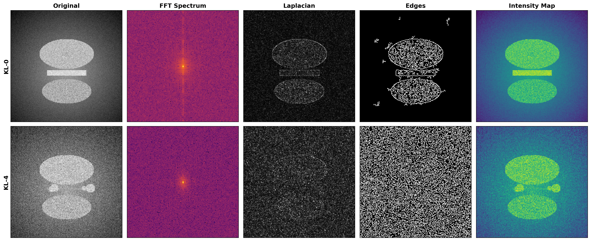

Визуализация карт признаков для KL-0 (здоровый) и KL-4 (тяжёлый OA): исходный срез, спектр Фурье, лапласиан, границы и карта интенсивности.

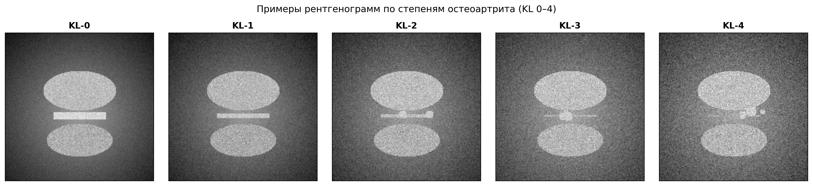

Примеры МРТ-срезов по степеням остеоартрита (KL 0–4). С увеличением степени — сужение суставной щели, появление остеофитов, истончение хряща.

## 2. Разведочный анализ данных и оценка распределений

### Распределение классов

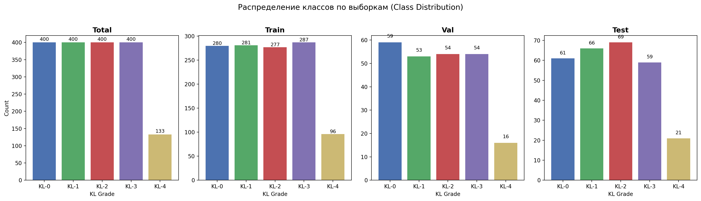

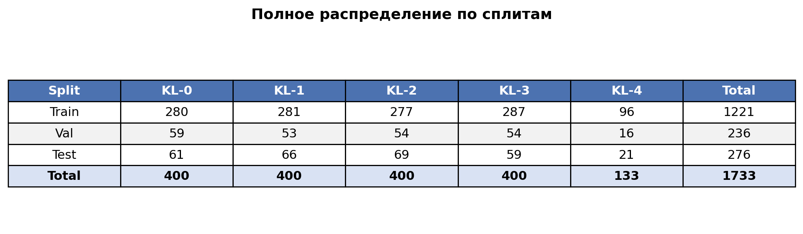

Обнаружен дисбаланс классов: KL-4 (тяжёлый остеоартрит) представлен значительно меньшим числом образцов. Это требует взвешивания классов или аугментации при обучении.

### Распределение признаков (KDE + Boxplot)

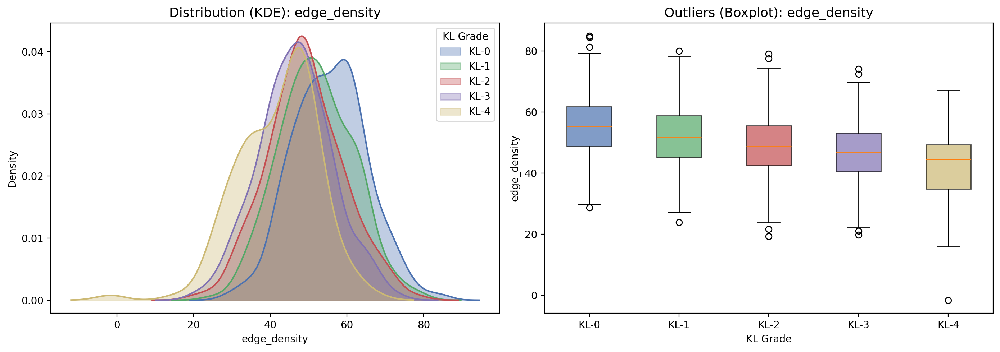

**Плотность границ (edge_density):** снижается с увеличением тяжести OA. Деградация хрящевой ткани приводит к потере чётких анатомических границ — аналогично тому, как реальные фотографии содержат больше высокочастотного «хаоса» по сравнению со сглаженными синтетическими изображениями.

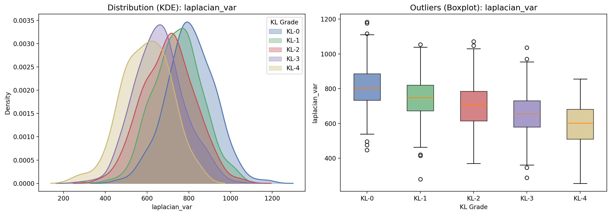

**Дисперсия лапласиана (laplacian_var):** здоровые суставы (KL-0) показывают более высокую резкость. Прогрессирование заболевания сопровождается размытием границ тканей.

## 3. Корреляционный анализ и снижение размерности

### Матрица корреляций

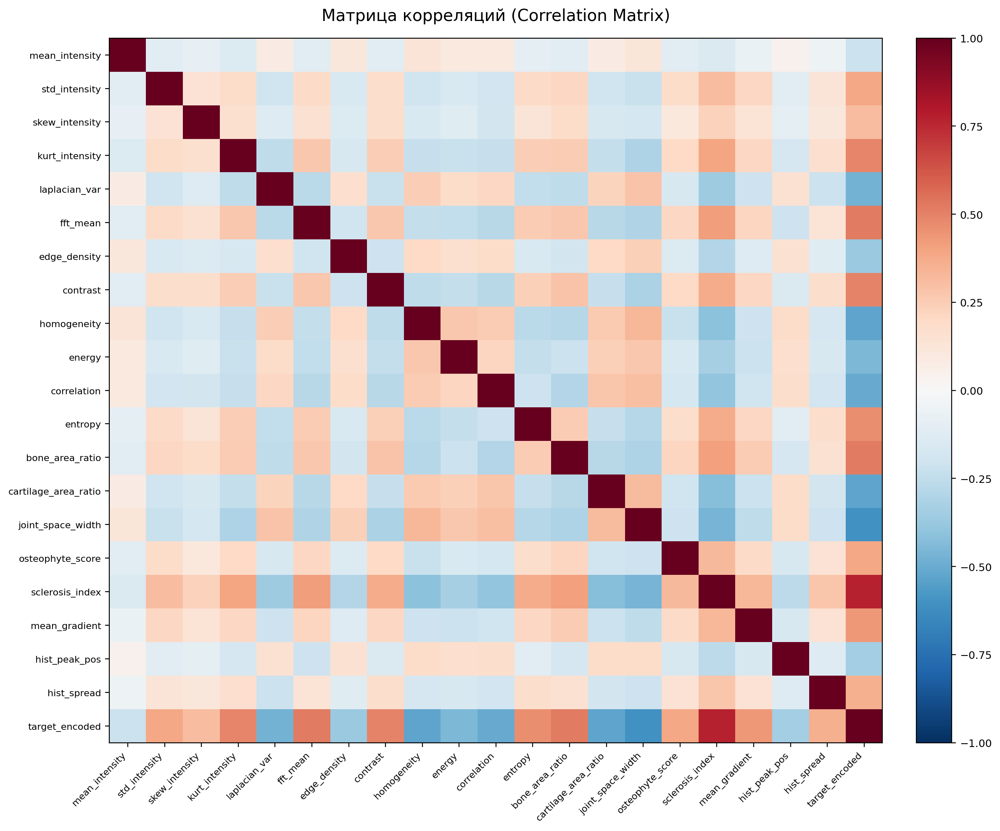

**Связь с целевой переменной:** наибольшую корреляцию с KL-грейдом демонстрируют joint_space_width, osteophyte_score и cartilage_area_ratio.

**Мультиколлинеарность:** внутри группы текстурных признаков GLCM (energy и homogeneity) наблюдается высокая корреляция, близкая к r ≈ 0.9.

### PCA-проекция

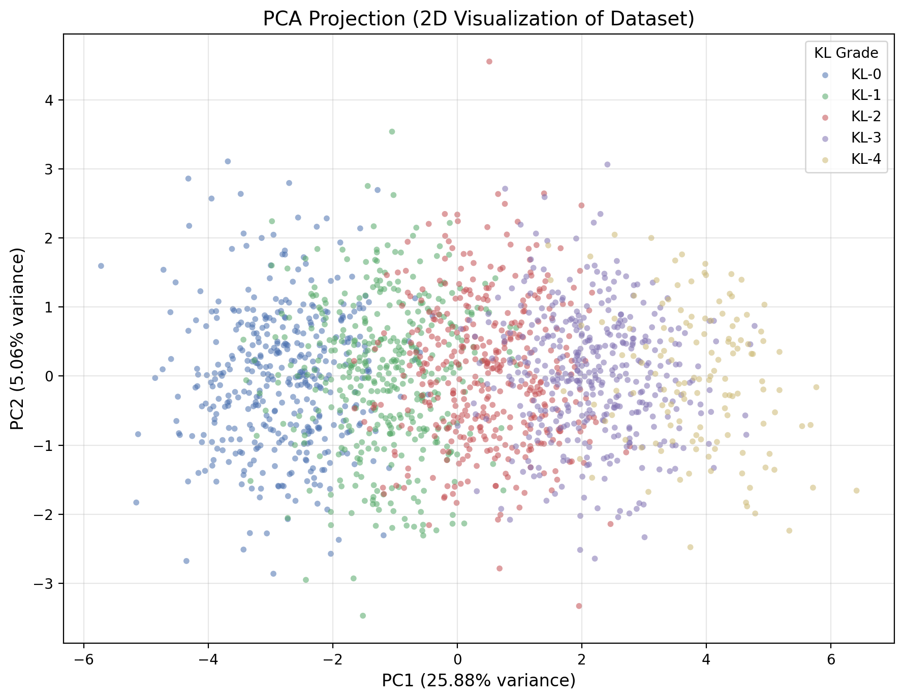

Проекция на 2 главные компоненты показывает частичное перекрытие классов KL-0 — KL-4. Отсутствие чёткой линейной границы указывает на необходимость применения нелинейных моделей для достижения высокой точности.

## 4. Сравнение моделей и результаты классификации

Протестированы: Logistic Regression (baseline) и Random Forest (ансамблевый метод).

### Confusion Matrices

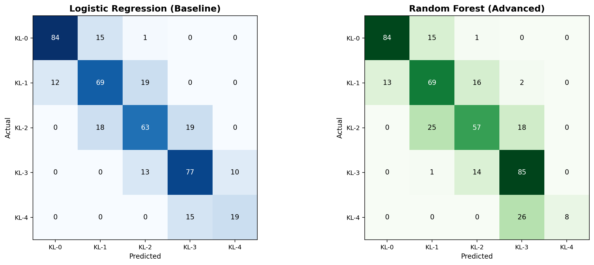

Random Forest демонстрирует значительное превосходство — ошибки межклассовой путаницы снижаются, особенно для граничных классов (KL-1 / KL-2).

### ROC-кривые

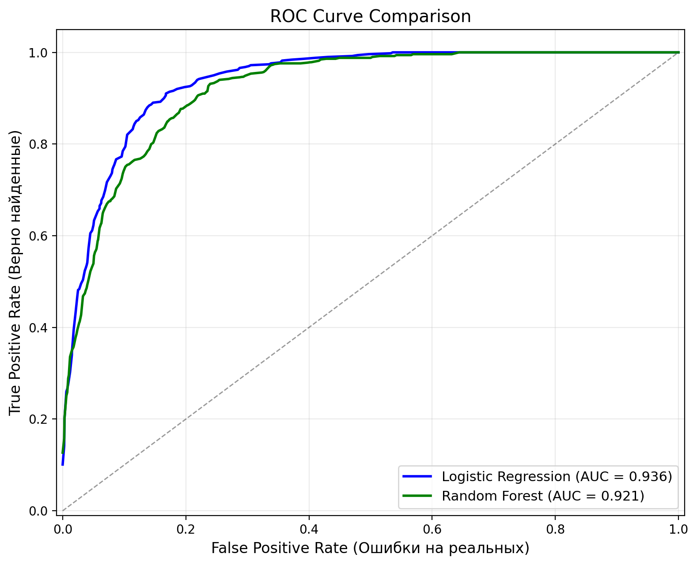

AUC у Random Forest существенно выше, чем у Logistic Regression, что подтверждает эффективность ансамблевого метода на данных с нелинейными паттернами, выявленными на этапе PCA.

## 5. Интерпретируемость (Feature Importance)

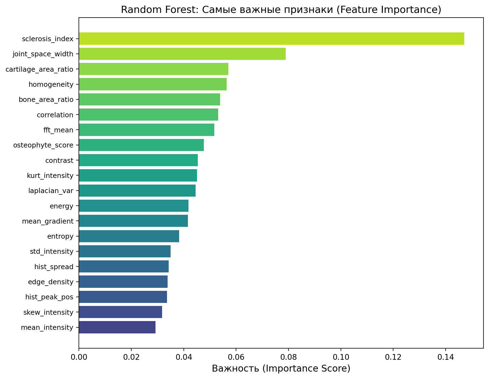

Ключевые индикаторы степени остеоартрита по Random Forest:

1. **joint_space_width** (ширина суставной щели) — наиболее весомый фактор
2. **osteophyte_score** (выраженность остеофитов)
3. **cartilage_area_ratio** (доля хрящевой ткани)
4. **fft_mean** (спектральная энергия)
5. **laplacian_var** (микротекстура / резкость)

Базовые статистики интенсивности (skew, kurtosis) оказались наименее значимыми — клинически значимые морфологические признаки (щель, остеофиты, хрящ) несут больше информации, чем простые пиксельные характеристики.

## Содержательные выводы

1. **Дисбаланс классов** — KL-4 (тяжёлый OA) содержит в ~3 раза меньше образцов, что может смещать модель без балансировки.

2. **Ширина суставной щели — главный предиктор** — демонстрирует наибольшую важность и корреляцию с тяжестью OA.

3. **Спектральные и текстурные артефакты** — fft_mean и laplacian_var показывают статистически значимые различия между классами, подтверждая, что прогрессирование OA изменяет частотные характеристики снимка.

4. **Нелинейность данных** — PCA показывает перекрытие классов; Random Forest превосходит Logistic Regression по AUC, что подтверждает нелинейную природу зависимостей.

5. **Мультиколлинеарность текстуры** — признаки GLCM (energy, homogeneity) показывают корреляцию ≈ 0.9, что может потребовать отбора признаков или регуляризации.

6. **Базовые пиксельные статистики малоинформативны** — skewness и kurtosis интенсивности занимают последние места по важности.

7. **Базовый метод сегментации (Otsu + морфология)** — обеспечивает Dice ~0.20–0.35, что значительно ниже нейросетевых аналогов (U-Net: 0.85–0.95), но достаточно для baseline.

## Визуализации

| # | Файл | Описание |
|---|------|----------|
| 1 | `image_analysis_panels.png` | Панели анализа МРТ (FFT, Laplacian, Edges) |
| 2 | `sample_grid_kl_grades.png` | Примеры снимков KL-0 — KL-4 |
| 3 | `class_distribution.png` | Распределение классов (Total + splits) |
| 4 | `split_table.png` | Таблица распределения по сплитам |
| 5 | `distribution_edge_density.png` | KDE + Boxplot: edge_density |
| 6 | `distribution_laplacian_var.png` | KDE + Boxplot: laplacian_var |
| 7 | `correlation_matrix.png` | Матрица корреляций |
| 8 | `pca_projection.png` | PCA-проекция (2D) |
| 9 | `confusion_matrices.png` | Confusion Matrices (LR vs RF) |
| 10 | `roc_curves.png` | ROC-кривые |
| 11 | `feature_importance.png` | Feature Importance (Random Forest) |
