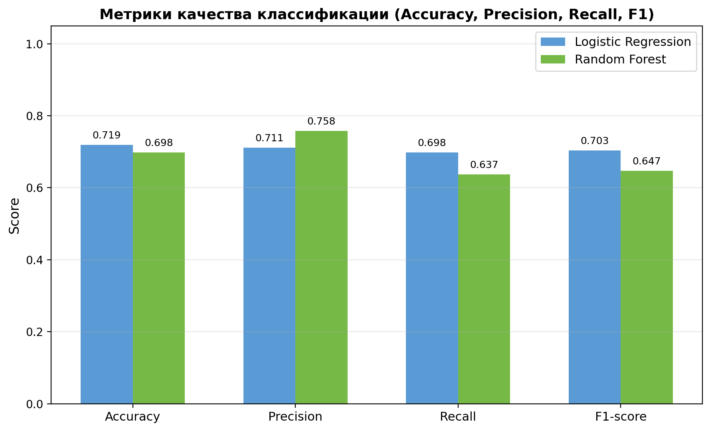

# Домашнее задание №2 — Метрики качества

**Курс:** Машинное обучение  
**Срок:** 23.02.2026 – 26.02.2026  
**Проект:** Knee MRI Cartilage Segmentation (классификация KL-грейдов)  
**Датасет:** 3D Knee MRI Cartilage Segmentation (Kaggle)  
**Модели:** Logistic Regression, Random Forest  


## Задание

Определить метрики качества: **Accuracy, Precision, Recall, F1-score** на том же датасете, оформить отчёт.


## Шаги выполнения

### 1. Активировать окружение и запустить пайплайн

```bash
cd knee_mri_segmentation
source ../.venv310/bin/activate
python -m src.eda_visualizations
```

### 2. Результаты (автоматически сохраняются)

| Файл | Описание |
|------|----------|
| `results/eda_figures/classification_metrics.csv` | Сводная таблица (Accuracy, Precision, Recall, F1) |
| `results/eda_figures/classification_metrics.png` | Визуализация метрик (bar chart) |
| `results/eda_figures/classification_report_logistic_regression.csv` | Per-class отчёт LR |
| `results/eda_figures/classification_report_random_forest.csv` | Per-class отчёт RF |


## Результаты

### Сводная таблица метрик

| Метрика | Logistic Regression | Random Forest |
|---------|--------------------:|-------------:|
| **Accuracy** | 0.7189 | 0.6982 |
| **Precision (macro)** | 0.7113 | 0.7580 |
| **Recall (macro)** | 0.6978 | 0.6371 |
| **F1-score (macro)** | 0.7032 | 0.6466 |

### Per-class метрики — Logistic Regression

| Класс | Precision | Recall | F1-score | Support |
|-------|----------:|-------:|---------:|--------:|
| KL-0 | 0.875 | 0.840 | 0.857 | 100 |
| KL-1 | 0.676 | 0.690 | 0.683 | 100 |
| KL-2 | 0.656 | 0.630 | 0.643 | 100 |
| KL-3 | 0.694 | 0.770 | 0.730 | 100 |
| KL-4 | 0.655 | 0.559 | 0.603 | 34 |

### Per-class метрики — Random Forest

| Класс | Precision | Recall | F1-score | Support |
|-------|----------:|-------:|---------:|--------:|
| KL-0 | 0.866 | 0.840 | 0.853 | 100 |
| KL-1 | 0.627 | 0.690 | 0.657 | 100 |
| KL-2 | 0.648 | 0.570 | 0.606 | 100 |
| KL-3 | 0.649 | 0.850 | 0.736 | 100 |
| KL-4 | 1.000 | 0.235 | 0.381 | 34 |

### Визуализация




## Определения метрик

- **Accuracy** — доля правильно классифицированных образцов от общего числа: $Accuracy = \frac{TP + TN}{TP + TN + FP + FN}$
- **Precision** — доля истинно положительных среди всех предсказанных положительных: $Precision = \frac{TP}{TP + FP}$
- **Recall** — доля истинно положительных среди всех реально положительных: $Recall = \frac{TP}{TP + FN}$
- **F1-score** — гармоническое среднее Precision и Recall: $F1 = 2 \cdot \frac{Precision \cdot Recall}{Precision + Recall}$

Для мультиклассовой задачи (5 KL-грейдов) используются усреднения:
- **macro** — среднее по классам без учёта дисбаланса
- **weighted** — среднее с весами пропорционально количеству образцов класса


## Анализ результатов

1. **Logistic Regression** показывает чуть более высокую общую Accuracy (0.72 vs 0.70), что объясняется более сбалансированным распознаванием всех классов.

2. **Random Forest** имеет более высокую Precision (macro = 0.76), но низкий Recall для KL-4 (0.24) — модель «осторожна» в серьёзных диагнозах.

3. **KL-0 (здоровый)** распознаётся лучше всего обеими моделями (F1 ≈ 0.85) — здоровые снимки имеют наиболее выраженные характерные признаки.

4. **KL-2 и KL-4** — наиболее сложные классы: KL-2 путается с соседними грейдами, KL-4 имеет мало образцов (дисбаланс).

5. Дисбаланс классов (KL-4 = 34 образца vs 100 у остальных) существенно влияет на Recall для RF — рекомендуется применить SMOTE или взвешивание классов.


## Код метрик

Функция `compute_classification_metrics()` в файле `src/eda_visualizations.py` вычисляет все 4 метрики с помощью `sklearn.metrics`:

```python
from sklearn.metrics import accuracy_score, precision_score, recall_score, f1_score

acc = accuracy_score(y_test, y_pred)
prec = precision_score(y_test, y_pred, average="macro")
rec = recall_score(y_test, y_pred, average="macro")
f1 = f1_score(y_test, y_pred, average="macro")
```
